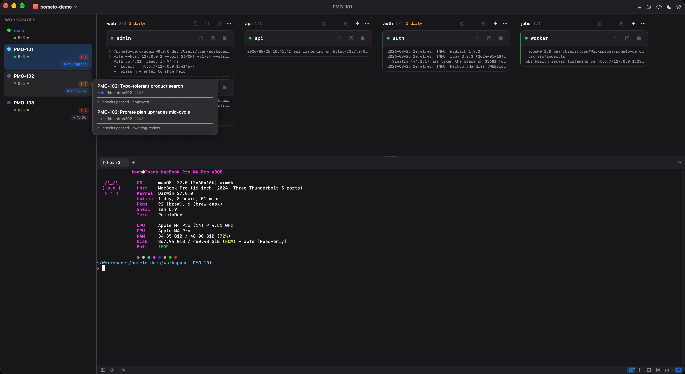
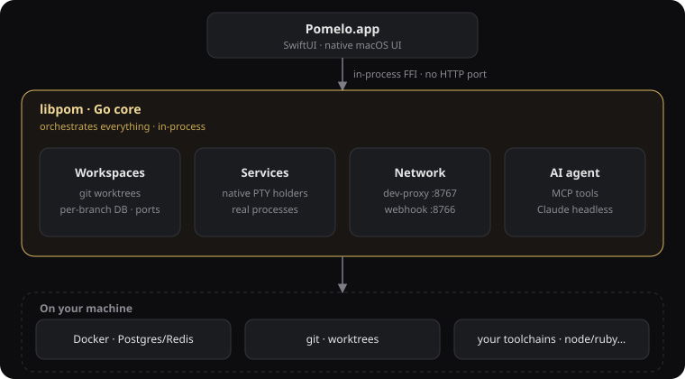

<p align="center">
  
</p>

<h1 align="center">Pomelo</h1>

<p align="center">
  A dev environment. One per branch.<br>
  A native macOS app for multi-repo projects — free and open source.
</p>

<p align="center">
  <a href="https://github.com/pomelohq/pomelo/releases/latest"></a>
  <a href="https://www.gnu.org/licenses/agpl-3.0"></a>
  <a href="#install"></a>
  <a href="https://pomelohq.app"></a>
</p>

<p align="center">
  
</p>

## About

Pomelo spins up a full, isolated, runnable environment for **every branch** of a
multi-repo project — services, databases, and shared infrastructure, wired
automatically. Each branch is a real git worktree with its own services, ports,
and databases, so two branches never collide. No YAML archaeology, no port
juggling.

## What's inside

- **One branch, one full stack.** Every workspace is a real git worktree with its
  own services, ports, and databases. Two branches never collide.
- **Fast switches.** New workspaces clone databases from a prepared `main`
  (`CREATE DATABASE … TEMPLATE`) and materialize `node_modules` via APFS
  copy-on-write — seconds, not rebuilds.
- **Native services, Docker only for data.** Your repos' services run as real
  native processes on self-managed PTY holders — lighter and faster than wrapping
  everything in containers. Only databases and shared infra
  (Postgres/Redis/MinIO/OpenSearch) run in Docker.
- **Native app, not Electron.** SwiftUI linking a Go core in-process over FFI — no
  localhost server, built for ProMotion.
- **Same-origin networking.** A built-in dev-proxy serves a frontend and its
  backends under one origin (no CORS), and a webhook relay fans inbound events out
  to every branch.
- **In-app database browser.** Inspect and query each branch's Postgres/Redis
  without leaving the app.
- **Agent-ready.** A built-in AI agent per workspace, wired to the environment it's
  working in via MCP tools.

## Why Pomelo

Hand-writing code is no longer the bottleneck — knowing a change is *correct* is.
That needs ground truth, not another opinion. Pomelo's moat is that **every branch
has a real, running environment**: DB, services, ports, resolved env. So when you
(or an AI agent) make a change, you can **run it and know** — not guess from a
diff.

The loop: **you reason → the agent types → the env proves → you judge.** Two
control points stay human — the shape of the commit/PR, and judging review
feedback. The agent never owns feature logic, and its output is suspect until the
env proves it.

## Architecture

Pomelo is a **native macOS app with a Go core linked in-process** — no daemon, no
background server, and no `localhost` port between the UI and the engine. The
native app (`desktop/PomeloApp`) links the transport-neutral core (`internal/`)
via the `libpom` c-archive FFI; the `pom` CLI drives the same core directly.
Config lives in a `pom.yml` (plus an optional `pom.d/` of fragments) found by
walking up from the current directory.

<p align="center">
  
</p>

## Install

Download the latest signed, notarized DMG from
[Releases](https://github.com/pomelohq/pomelo/releases/latest), drag **Pomelo**
into **Applications**, and open it. macOS 14+ · Apple Silicon.

Full docs: **https://pomelohq.app**

## Build from source

Requires Go 1.26+, Xcode, and `zsh`.

```bash
# CLI / Go core
make build            # -> ./pom

# Native macOS app (Go c-archive -> SwiftPM/xcodebuild)
cd desktop/PomeloApp && ./build.sh
```

See [`RELEASE.md`](RELEASE.md) for the packaging / notarization flow.

## Contributing

Contributions are welcome. See [`CONTRIBUTING.md`](CONTRIBUTING.md) for the
build/test workflow, code style, and the DCO sign-off we require on every commit.
By participating you agree to the [Code of Conduct](CODE_OF_CONDUCT.md).

## License

Copyright (C) 2026 Toan Tran.

Pomelo is free software licensed under the [GNU AGPL-3.0](LICENSE). Commercial
licensing is available from the copyright holder.
